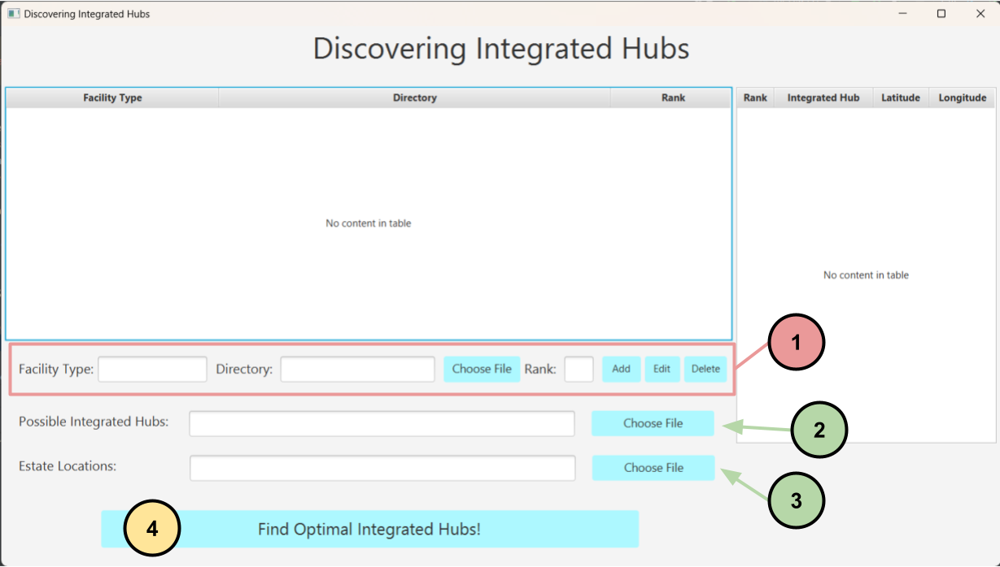

# Discovering Integrated Hubs!

## Installation
Down Load :]

## Usage
Our project can be accessed either through `CommandLineTool.java` or the executable JAR.

### Command Line Utility
1. Navigate to `/src/classes/CommandLineTool.java`.
2. Run the `main` program.
3. Key in the numbers 1 to 5, separated by spaces, according to the instructions. This will decide how the facility types are prioritised.
4. Press enter again to get a list of recommendations! The output will be a list of integrated hub locations, with the optimal locations first.

### JAR Application (with GUI)

1. Add facilities (add as many as possible, samples are given under src/resources/updated (any file except ith_locations.csv, estate_locations.csv)
* Type in a facility type
* Click choose file and select a file facility csv
* Input rank (importance; higher is better)
* Click add!
* To edit an entry, select the row in the table for its information to appear in the textfields. Then press edit to save changes.
* You can also select a row to delete it.
 
2. Add possible integrated hubs
* Click choose file and select possible integrated hub locations (sample provided as src/resources/updated/ith_locations.csv)
  
3. Add estate locations
* Click choose file and select estate locations (sample provided as src/resources/updated/estate_locations.csv)
  
4. Press find optimal integrated hubs!
* Result table will be shown on the right table view in descending order, where the most optimal integrated hub will be shown at the top
  

More information can be found in our report, and a video demonstration can be found here: https://drive.google.com/file/d/16OT_NPhc4tIig7zmb3HRHbOpJQ0Bzc2a/view?usp=sharing

## Contributing
We are not accepting collaborations at this time. Feel free to fork this repository and make your own changes!

## License
MIT License

Copyright (c) 2022 

Permission is hereby granted, free of charge, to any person obtaining a copy of this software and associated documentation files (the "Software"), to deal in the Software without restriction, including without limitation the rights to use, copy, modify, merge, publish, distribute, sublicense, and/or sell copies of the Software, and to permit persons to whom the Software is furnished to do so, subject to the following conditions:

The above copyright notice and this permission notice shall be included in all copies or substantial portions of the Software.

THE SOFTWARE IS PROVIDED "AS IS", WITHOUT WARRANTY OF ANY KIND, EXPRESS OR IMPLIED, INCLUDING BUT NOT LIMITED TO THE WARRANTIES OF MERCHANTABILITY, FITNESS FOR A PARTICULAR PURPOSE AND NONINFRINGEMENT. IN NO EVENT SHALL THE AUTHORS OR COPYRIGHT HOLDERS BE LIABLE FOR ANY CLAIM, DAMAGES OR OTHER LIABILITY, WHETHER IN AN ACTION OF CONTRACT, TORT OR OTHERWISE, ARISING FROM, OUT OF OR IN CONNECTION WITH THE SOFTWARE OR THE USE OR OTHER DEALINGS IN THE SOFTWARE.